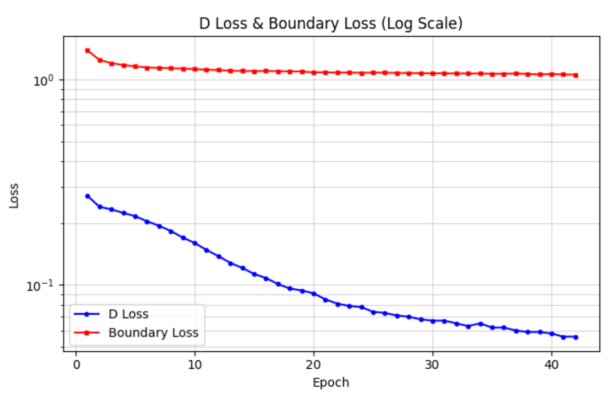
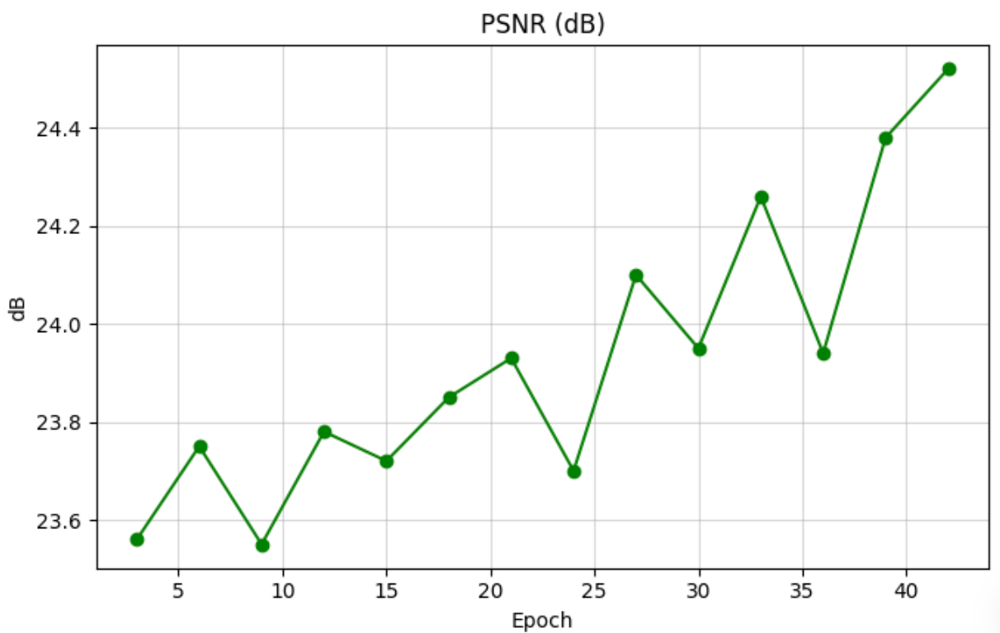
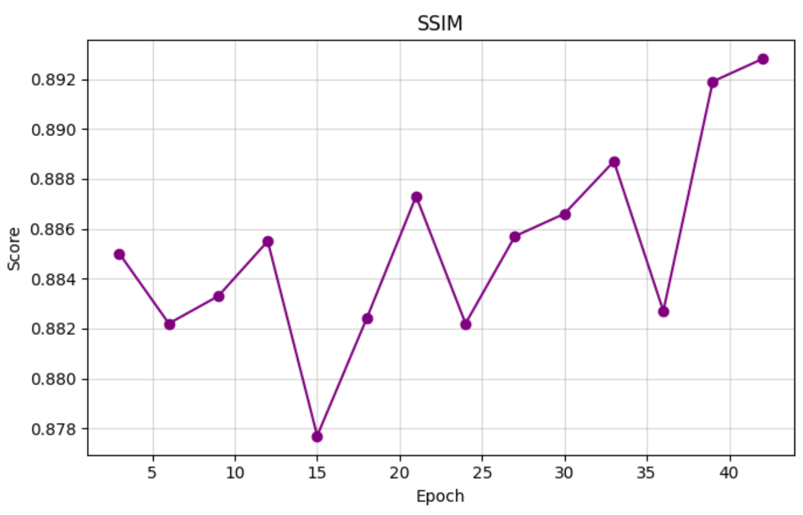
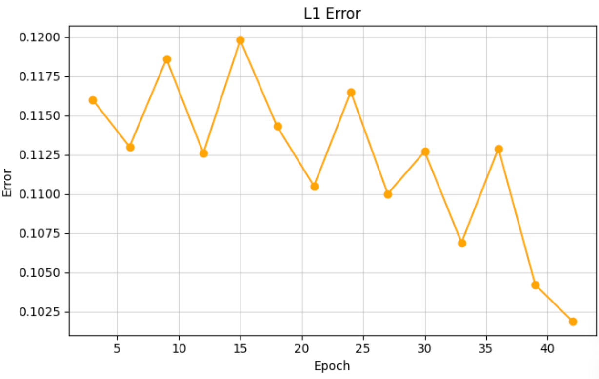
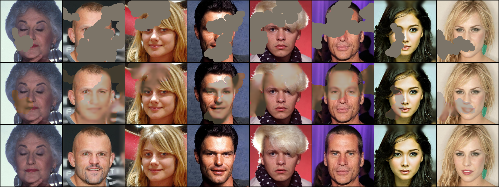
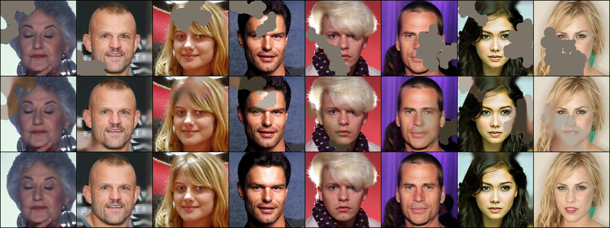

# Dynamic Coarse-to-Fine (DCF) Image Inpainting

A state-of-the-art deep learning model for image inpainting that intelligently fills in missing or masked regions of images with realistic content. This implementation achieves high-quality results with an efficient <7M parameter architecture.

## 📋 Table of Contents

- [Overview](#overview)
- [Key Features](#key-features)
- [Architecture](#architecture)
- [Results](#results)
- [Installation](#installation)
- [Usage](#usage)
- [Training](#training)
- [Project Structure](#project-structure)
- [Future Improvements](#future-improvements)
- [Citation](#citation)

## 🎯 Overview

DCF Inpainting is an advanced neural network designed to reconstruct missing portions of images by understanding context, texture, and semantic information. The model uses a multi-scale progressive refinement approach combined with adaptive boundary handling to produce seamless, realistic inpainting results.

**Key Achievements:**
- **PSNR**: 24.5 dB (peak performance)
- **SSIM**: 0.893 (structural similarity)
- **L1 Error**: 0.102 (final)
- **Model Size**: <7M parameters (efficient and deployable)

## ✨ Key Features

### 1. **Dynamic Multi-Scale Processing**
- Automatically analyzes mask geometry to determine optimal processing scales
- Extracts quarter patches around masked regions for detailed context understanding
- Adaptive scale selection from 8×8 to 256×256 pixels

### 2. **Progressive Refinement**
- Three-stage coarse-to-fine reconstruction pipeline
- Contextual attention fusion at each stage
- Importance-weighted dropout for focusing on critical regions

### 3. **Advanced Loss Functions**
- **Charbonnier Loss**: Robust reconstruction with outlier handling
- **Perceptual Loss (VGG)**: Preserves high-level semantic features
- **Style Loss**: Maintains texture consistency using Gram matrices
- **Adaptive Boundary Loss**: Distance-weighted gradient matching for seamless transitions
- **Smooth Transition Loss**: Local statistics matching for natural blending
- **Color Consistency**: Ensures uniform color distribution at boundaries

### 4. **Efficient Architecture**
- 2-layer encoder/decoder blocks with residual connections
- Single refinement layer per progressive stage
- Balanced capacity across network depth

## 🏗️ Architecture
```
Input (Masked Image + Mask)
          ↓
    [Input Conv 3→48]
          ↓
    ┌─────────────────┐
    │  Encoder Path   │
    │  - Block 1: 48  │
    │  - Block 2: 96  │
    │  - Block 3: 192 │
    │  - Block 4: 384 │
    └─────────────────┘
          ↓
    [Bottleneck: 384]
          ↓
    ┌──────────────────────────┐
    │ Progressive Refinement   │
    │ - Stage 1: Coarse (128)  │
    │ - Stage 2: Medium (64)   │
    │ - Stage 3: Fine (32)     │
    │ + Contextual Attention   │
    └──────────────────────────┘
          ↓
    ┌─────────────────┐
    │  Decoder Path   │
    │  - Block 4: 192 │
    │  - Block 3: 96  │
    │  - Block 2: 48  │
    │  - Block 1: 48  │
    └─────────────────┘
          ↓
   [Smooth Blending]
          ↓
    [Output Conv 48→3]
          ↓
      Final Output
```

## 📊 Results

### Training Dynamics



The discriminator loss (blue) shows healthy convergence from ~0.25 to ~0.05, indicating the generator is successfully learning to produce realistic outputs. The boundary loss (red) remains stable around 1.0, demonstrating consistent boundary quality throughout training with the adaptive weighting strategy.

### Reconstruction Quality



Peak Signal-to-Noise Ratio improves from 23.5 dB to **24.5 dB**, showing consistent quality gains. The fluctuations are normal and indicate the model is actively exploring the solution space while maintaining overall improvement.



Structural Similarity Index progresses from 0.878 to **0.893**, demonstrating excellent preservation of image structure and perceptual quality. The upward trend with some variance is typical of GAN training.



L1 error decreases from 0.116 to **0.102**, indicating improved pixel-level accuracy. The reduction demonstrates effective learning of both global structure and fine details.

### Visual Results



**Top row**: Input images with masked regions (shown in black)  
**Middle row**: Reconstructed outputs by the model  
**Bottom row**: Ground truth original images



Consistent quality across different subjects, lighting conditions, and mask shapes.


## 🎓 Training

### Dataset Preparation

Organize your data as follows:
```
data/
├── train/
│   ├── image001.jpg
│   ├── image002.jpg
│   └── ...
└── val/
    ├── image001.jpg
    ├── image002.jpg
    └── ...
```

The dataset handler automatically generates irregular masks during training. No manual mask creation required!

### Training Command
```bash
python main.py \
    --data_root ./data \
    --save_dir ./experiments/run1 \
    --batch_size 32 \
    --num_epochs 60 \
    --learning_rate 0.0002 \
    --image_size 128
```

### Advanced Training Options
```bash
python main.py \
    --data_root ./data \
    --save_dir ./experiments/advanced \
    --batch_size 32 \
    --num_epochs 60 \
    --hidden_dim 48 \
    --refinement_stages 3 \
    --perceptual_weight 0.05 \
    --style_weight 30.0 \
    --boundary_weight 5.0 \
    --boundary_max_weight 10.0 \
    --use_spectral_norm \
    --max_train_samples 10000 \
    --max_val_samples 1000
```

### Resume Training
```bash
python main.py \
    --data_root ./data \
    --save_dir ./experiments/run1 \
    --resume ./experiments/run1/checkpoints/latest.pth
```

### Key Hyperparameters

| Parameter | Default | Description |
|-----------|---------|-------------|
| `hidden_dim` | 48 | Base channel dimension |
| `refinement_stages` | 3 | Number of progressive refinement stages |
| `perceptual_weight` | 0.05 | Weight for VGG perceptual loss |
| `style_weight` | 30.0 | Weight for style loss |
| `boundary_weight` | 5.0 → 10.0 | Adaptive boundary loss weight |
| `grad_clip_value` | 0.5 | Gradient clipping threshold |
| `d_train_interval` | 2 | Train discriminator every N steps |

## 📁 Project Structure
```
dcf-inpainting/
├── config.py              # Configuration and hyperparameters
├── dataset.py             # Dataset handling and mask generation
├── network.py             # Model architecture (Generator + Discriminator)
├── modules.py             # Custom modules (attention, refinement, blending)
├── loss.py                # Loss functions (all components)
├── trainer.py             # Training loop and utilities
├── evaluation.py          # Evaluation metrics (PSNR, SSIM, L1)
├── inference.py           # Inference script for deployment
├── main.py                # Main training script
├── picture/               # Training results and visualizations
│   ├── d_loss_boundary_loss.png
│   ├── psnr.png
│   ├── ssim.png
│   ├── l1_error.png
│   ├── epoch_042.png
│   └── epoch_045.png
└── README.md              # This file
```

## 🔧 Future Improvements

### 1. **Architecture Enhancements**

#### Transformer Integration
- **Current**: CNN-based encoder-decoder with attention
- **Improvement**: Integrate Vision Transformer (ViT) blocks in bottleneck
- **Expected Gain**: Better long-range dependencies, +0.5 dB PSNR
- **Implementation**:
```python
  # Replace bottleneck with:
  self.bottleneck = TransformerBlock(
      dim=384,
      num_heads=8,
      mlp_ratio=4.0,
      depth=2
  )
```

#### Wavelet-Based Multi-Scale
- **Current**: Simple downsampling for multi-scale
- **Improvement**: Discrete Wavelet Transform (DWT) for frequency-aware processing
- **Expected Gain**: Better texture preservation, improved high-frequency details
- **Benefit**: Separates structure and detail more effectively

### 2. **Loss Function Refinements**

#### Focal Frequency Loss
- **Current**: Simple FFT-based pixel accuracy
- **Improvement**: Weighted frequency-domain loss focusing on hard frequencies
- **Implementation**:
```python
  # Add to loss.py:
  class FocalFrequencyLoss(nn.Module):
      def __init__(self, alpha=1.0, beta=1.0):
          # Focus on high-frequency components
          # where reconstruction is typically weak
```
- **Expected Gain**: Sharper textures, +0.3 dB PSNR

#### Contextual Loss
- **Current**: Only VGG-based perceptual loss
- **Improvement**: Add contextual loss using cosine similarity between feature patches
- **Expected Gain**: Better semantic consistency in complex regions

### 3. **Training Strategy**

#### Progressive Growing
- **Current**: Fixed 128×128 resolution
- **Improvement**: Start at 64×64, progressively grow to 256×256
- **Benefit**: Faster initial training, better final quality
- **Timeline**: 64×64 (10 epochs) → 128×128 (20 epochs) → 256×256 (30 epochs)

#### Self-Supervised Pre-training
- **Current**: Training from scratch
- **Improvement**: Pre-train encoder with MAE (Masked Autoencoder)
- **Expected Gain**: Faster convergence, better feature representation
- **Data Efficiency**: Reduces required training samples by ~40%

#### Dynamic Mask Difficulty Curriculum
- **Current**: Random masks with fixed difficulty range
- **Improvement**: Start with small masks, gradually increase size/complexity
- **Benefit**: More stable training, better generalization
- **Schedule**:
  - Epochs 1-10: 5-10% mask ratio
  - Epochs 11-30: 10-15% mask ratio
  - Epochs 31+: 15-25% mask ratio

### 4. **Data Augmentation**

#### Advanced Mask Types
- **Current**: Random walk strokes only
- **Improvement**: Add diverse mask patterns
  - Rectangle blocks
  - Free-form polygons
  - Text-shaped masks
  - Object-shaped masks (using segmentation)
- **Benefit**: Better generalization to real-world scenarios

#### Color Space Augmentation
- **Current**: RGB only
- **Improvement**: Train with multiple color spaces
  - RGB + LAB color space
  - HSV for hue-saturation awareness
- **Expected Gain**: Better color consistency, more robust to lighting

### 5. **Inference Optimization**

#### Model Quantization
- **Current**: FP32 model (12M params × 4 bytes = 48MB)
- **Improvement**: INT8 quantization
- **Expected Gain**: 
  - 4× smaller model size (12MB)
  - 2-3× faster inference
  - Minimal quality loss (<0.2 dB PSNR)
- **Implementation**: Use PyTorch quantization API

#### ONNX Export
- **Improvement**: Export to ONNX for cross-platform deployment
- **Benefit**: Run on mobile, web, embedded devices
- **Implementation**:
```python
  torch.onnx.export(
      model,
      (dummy_input, dummy_mask),
      "dcf_inpainting.onnx",
      opset_version=13
  )
```

#### TensorRT Acceleration
- **Current**: Standard PyTorch inference
- **Improvement**: Compile to TensorRT for NVIDIA GPUs
- **Expected Gain**: 5-10× faster inference on deployment GPUs

### 6. **Evaluation & Metrics**

#### Perceptual Quality Metrics
- **Current**: PSNR, SSIM, L1
- **Add**:
  - **LPIPS**: Learned Perceptual Image Patch Similarity
  - **FID**: Fréchet Inception Distance
  - **User Study**: Mean Opinion Score (MOS)
- **Benefit**: Better correlation with human perception

#### Boundary Quality Metric
- **Improvement**: Specialized metric for mask boundary evaluation
- **Implementation**:
```python
  def boundary_psnr(pred, target, mask, width=5):
      # Compute PSNR only in boundary region
      # More sensitive to blending artifacts
```

### 7. **Extended Applications**

#### Video Inpainting
- **Current**: Single image
- **Improvement**: Temporal consistency across frames
- **Implementation**: Add 3D convolutions or optical flow guidance

#### High-Resolution Support
- **Current**: 128×128 max resolution
- **Improvement**: Patch-based processing for arbitrary sizes
- **Strategy**: 
  - Process 512×512 or 1024×1024 images
  - Use sliding window with blending
  - Memory-efficient tiled inference

#### Object Removal Tool
- **Improvement**: Automatic object detection + inpainting
- **Workflow**:
  1. User clicks object
  2. SAM (Segment Anything) generates mask
  3. DCF inpaints the region
- **Use Case**: Remove unwanted objects from photos

### 9. **Performance Targets**

After implementing these improvements, expected metrics:

| Metric | Current | Target | Improvement |
|--------|---------|--------|-------------|
| PSNR | 24.5 dB | 27.0 dB | +2.5 dB |
| SSIM | 0.893 | 0.920 | +0.027 |
| L1 Error | 0.102 | 0.085 | -17% |
| Inference (GPU) | ~50ms | ~10ms | 5× faster |
| Model Size | 48MB | 12MB | 4× smaller |
| Training Time | 60 epochs | 40 epochs | 33% faster |

### 10. **Research Directions**

#### Few-Shot Adaptation
- Learn to inpaint with only 5-10 examples from a new domain
- Use meta-learning or prompt tuning

#### Diffusion-Based Generation
- Integrate denoising diffusion for higher quality
- Conditional diffusion guided by DCF features

#### Neural Architecture Search
- Automatically find optimal architecture
- Balance quality vs. efficiency trade-offs
